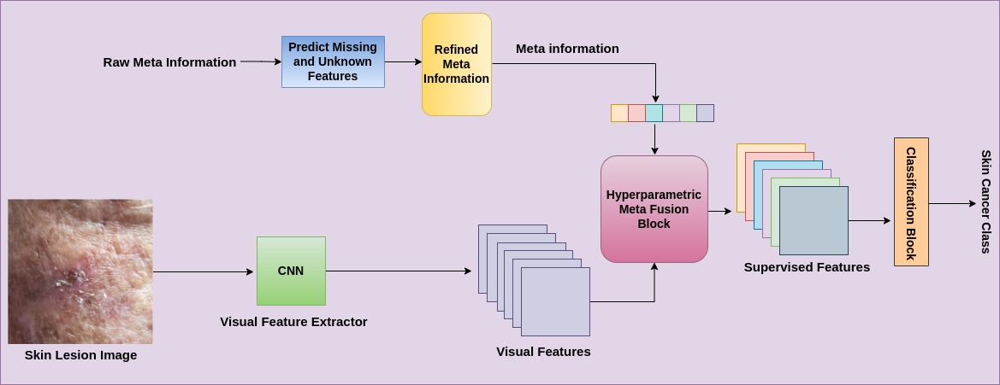

# Hyperparametric Meta Fusion Block

The code files are currently private since our work is under review in ICPR'22. They will be made publicly available soon after the paper is published/accepted for publication.

<!-- Towards Improved Skin Lesion Classification using Metadata Supervision -->

==============================================================================================

The manuscript is under review (ICPR 2022), its complete implementation details, full-text and codes will be shared after publication.<br>
**[Towards Improved Skin Lesion Classification using Metadata Supervision]**<br>
[Anshul Pundhir](https://anshulpundhir.github.io/), [Saurabh Dadhich](https://www.linkedin.com/in/saurabh-dadhich-a496a8197/), [Ananya Agarwal](https://www.linkedin.com/in/ananya-agarwal-500597192), and [Balasubramanian Raman](http://faculty.iitr.ac.in/~balarfma/)  


<!---->


Setup and Dependencies
----------------------
1. Install Anaconda or Miniconda distribution and create a conda environment with **Python 3.8+**.
2. Install the requirements using the following command:
```sh
pip install -r Requirements.txt
```
3. Download the [PAD-UFES-20 dataset] and keep in `data` folder.
4. Rest of the data files are already provided in the	repository.

<!---
If you use this code in your published research, please consider citing:
```text
@inproceedings{}
```
--->
